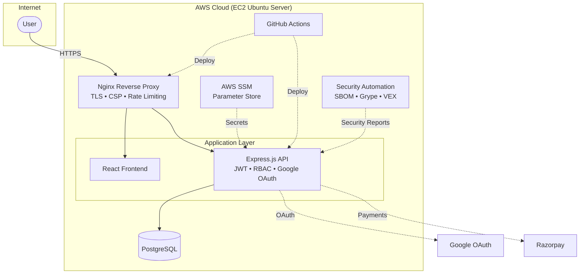

# Secure Application Development

### Practical Implementation of the Secure Development Lifecycle (SDLC)

*A production-inspired secure web application showcasing Secure SDLC principles through secure software engineering, AWS deployment, DevSecOps automation, penetration testing using Kali Linux and OWASP ZAP, and continuous security validation.*

---

---

# Overview

This organization contains the complete implementation of our **Secure Software Development Lifecycle (SDLC)** project developed as part of the **HPE Career Preview Program (CPP-3)**.

Rather than building only an e-commerce application, the objective was to engineer a production-inspired system where security is integrated throughout the software lifecycle—from architecture and secure coding to deployment, validation, monitoring, and software supply chain security.

The project demonstrates how modern web applications can be developed using security best practices while maintaining a practical deployment workflow on AWS.

---

# Project Objectives

The project was developed to implement a secure, production-inspired web application by following the principles of the **Secure Development Lifecycle (SDLC)**. The objectives were to address both application-level and infrastructure-level security through practical implementation.

| Secure Web Application | Secure Linux / Host / VM |
|-------------------------|--------------------------|
| Prevent SQL Injection, Cross-Site Scripting (XSS), and input validation vulnerabilities | Harden the Linux host through secure configuration and least-privilege principles |
| Implement network segmentation and secure communication between application components | Separate database, web, and infrastructure administrative responsibilities |
| Protect backend services and database access | Configure host-level firewall and network access controls |
| Implement Role-Based Access Control (RBAC) for different user levels | Harden exposed services by minimizing the attack surface and securing network ports |
| Secure password storage and database credentials | Apply secure password policies and cryptographic password hashing |
| Secure web communication using TLS certificates | Restrict shell access using secure authentication and role separation |
| Use trusted open-source software and dependencies | Protect storage, filesystems, and application data from unauthorized access |
| Generate Software Bills of Materials (SBOMs) and perform vulnerability analysis using Syft and Grype | Verify system integrity and minimize the risk of unwanted or malicious software |

---

# System Architecture

Security is implemented across multiple layers including:

- Secure application design
- Container isolation
- Docker network segmentation
- Linux host hardening
- AWS Security Groups
- Identity and access management
- Secret management
- Continuous security validation

---

# Explore the Project

The Secure Application Development project is organized into dedicated repositories that separate implementation, documentation, automation, and project deliverables.

### Application

➡️ **[secure-ecommerce-platform](https://github.com/HPE-CPP26-RED/Secure-Web-Application-Dev)**

Complete source code, production configuration, Docker deployment, authentication, RBAC, and CI/CD.

---

### Documentation

➡️ **[security-documentation](https://github.com/HPE-CPP26-RED/security-documentation)**

Architecture, security controls, infrastructure, deployment guides, testing methodology, and validation documentation.

---

### DevSecOps

➡️ **[security-automation](https://github.com/HPE-CPP26-RED/security-automation)**

SBOM generation, vulnerability scanning, VEX generation, automated security jobs, and reporting.

---

### Project Deliverables

➡️ **[project-artifacts](https://github.com/HPE-CPP26-RED/project-artifacts)**

Final presentations, demonstration videos, interview handbooks, reports, and supporting project artifacts.

---

# Security Features

- JWT Authentication
- Google OAuth Integration
- Multi-Factor Authentication (MFA)
- Role-Based Access Control (RBAC)
- Docker Network Segmentation
- Linux Hardening
- AWS Security Groups
- AWS Systems Manager Parameter Store
- HTTPS and TLS
- Content Security Policy (CSP)
- Security Headers
- Rate Limiting
- Secure Secret Management
- SBOM Generation (Syft)
- Vulnerability Scanning (Grype)
- Automated CI/CD Pipeline
- Security Validation using OWASP ZAP and Kali Linux

---

# Project Team

This project was developed collaboratively as part of the **HPE Career Preview Program (CPP-3)**. Responsibilities were distributed across backend development, frontend engineering, cloud infrastructure, security, testing, and DevSecOps, with collaboration across multiple components throughout the project lifecycle.

| Team Member | Primary Responsibilities |
|-------------|--------------------------|
| **Aravind Kamath** | Led **AWS deployment and DevSecOps**, implementing AWS Security Groups, IAM, Linux RBAC, AWS Systems Manager Parameter Store, CI/CD automation, SBOM generation, vulnerability scanning, and production deployment. |
| **Aasthi B. Shetty** | Focused on **backend security**, implementing authentication, authorization, secure password management, cryptographic controls, and strengthening secure coding practices. |
| **Aman Marian Cutinha** | Developed the **frontend interface**, integrating Google OAuth, payment gateway functionality, and client-side security to deliver a secure and responsive user experience. |
| **D. Vivek Pai** | Led **security testing and infrastructure validation** using OWASP ZAP, Kali Linux, and manual penetration testing, while validating Linux hardening, Docker network isolation, and infrastructure security controls. |
| **Delston Aaron Pereira** | Contributed to **full-stack development**, implementing frontend and backend features, API integration, database functionality, and supporting system integration and application testing. |

---

# Learning Outcomes

This project provided practical experience in:

- Secure Software Development Lifecycle (SDLC)
- Full-stack application development
- Cloud deployment on AWS
- Infrastructure security
- Containerization
- DevSecOps
- Threat mitigation
- Security testing
- Software supply chain security
- Secure production deployment

---

*"Security is not a feature added at the end of development—it is a design principle integrated throughout the entire software lifecycle."*

